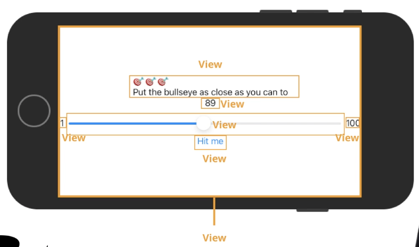

# SwiftUI Notes

## Getting Started with SwiftUI

- Requires Xcode 12 or later
  - Shown on the client
- SwiftUI vs. UIKit
  - SwiftUI
    - Hot new way to create interfaces in Swift
    - UI is created completely in code, dynamically updated in Canvas Editor
    - Can get Canvas Editor to code directly on your behalf or code yourself
    - Easy to work with teams, port apps to MacOS, Watch OS, etc.
  - UIKit
    - Still valid way to create apps, developers still are using it
    - Why UIKit still?
      - SwiftUI only supports iOS 13 or later
      - SwiftUI is still early in development (2019) (UIKit out for 12 years), some companies want to give it time to grow
      - UIKit legacy code, hard to port over, many apps written in UIKit
  - Learn both
    - SwiftUI is the future of app development, can make knowledge future-proof
    - UIKit is important if you work for a company that's been around for a while
    - Can make certain part of app in UIKit
- Lesson Plan
  - First app - An app from scratch: must-haves to create MVP
  - First app - Polishing the app: nice-to-haves in programming TODO list, making app pretty
  - Programming in Swift: Fundamentals
  - Second app - habit tracking app
  - Programming in Swift: Functions and types
- Future learning paths: iOS User Interfaces, iOS Data and Networking, iOS IDEs and Tools
  - UIKit: iOS User Interfaces with UIKit
- Programming To-Do List
  - Segment app into milestones, get MVP while you continue to add new features
  - Break down into pieces, makes project a lot more daunting because you know where to start
  - "Must Haves"
    - Add an instruction label
    - Add a target label
    - Add a slider and make it go between the values 1 and 100
    - Add a "Hit Me" button
    - Style the text like Luke's design
    - Show a popup when the user taps the "Hit Me" button
    - Read the value after the user taps the "Hit Me" button
    - Generate a random number for the target value
    - Calculate and display the score
  - "Nice to Haves"
    - Implement multiple rounds
    - Implement restarting the game
    - Add the leaderboard screen
    - Make the app look pretty
- Views: anything that gets drawn on the screen
  - Button, text, slider
  - Any user interface control
  - Some act as containers for other views
  - Biggest view: screen itself
- Some views in SwiftUI



- Text: Displays one or more lines of text

- Slider: Lets user slide a control (thumb) along a straight line track with minimum and maximum

- Button: Performs an action when you tap on it

  - Can put any view inside of a button, e.g. text

- Vertical Stack: VStack acts as container for other views (children). Arrange vertically

- Horizontal Stack: HStack acts as container for other views (children). Arrange horizontally

- Learning via repetition

- Understand auto-generated code, don't have to understand what's going on

- SwiftUI Views

  - `ContentView.swift`: Using the most for the beginning part of the course - file responsible for what the main screen looks like
  - Resume automatic preview
  - Can update views in the canvas or in the code
  - Plus → object library
  - Be careful of where to let go of dragged object
  - Can drag onto canvas or to code itself (start of line after, creates new line)
  - Button `action` default: block with no code
  - Landscape mode: `previewLayout``
  - ``ContentView_Preview`: Provides preview of app
  - Text dynamically resizes depending on dimensions
  - Run actual simulator using Play button
  - Rotate left and right, Cmd+< and Cmd+>

- View Modifiers

  - Modify style of view, e.g. opacity, box shadow, corner radius

  - Behind the scenes, adding a modifier means that SwiftUI creates a new modified version of the view the modifier is applied on

  - 

  - ``` swift
    Text("100")
    	.opacity(0.5)
    	.border(Color.red, width: 2)
    ```

    - What will the border look like?
      - Opaque border, partially transparent
      - Order matters, switch the modifier order

- Some view modifiers in SwiftUI

  - Kerning, Bold, Font, Line Spacing, Multiline text alignment
  - Font spacing: iOS has a way to increase or decrease font sizing which is good for accessibility
    - Apple encourages to use preset font style for title, headlines, captions, etc.
  - Button to the right of preview on canvas lets you change size set in settings
  - Help -> developer documentation
  - `some View`: Any kind of view
  - `multilineTextAlignment` and `lineSpacing` work on any kind of view

- Objects, Data, and Methods

  - Group related data and functionality into small pieces
    - e.g. List of dogs - template with name and breed property
    - Create instances of template (filled in versions)
    - `class` and `struct`: structs in Swift are powerful so differences are more subtle
  - App is just a bunch of instances that communicate with each other
    - Instance of `Button` template inside `ContentView`
    - Declared struct called `ContentView` and described what its body will look like
  - `class`/`struct` can have data and functionality
    - Data: view to display, position, width, height
    - Functionality: recognize user tap, highlight self, trigger action
  - Method: provides functionality
    - `bold()` and `kerning()` were called on `Text` instance
    - Store data in structs using a property
    - Two types: **stored property** and **computed property**
      - Code to run to calculate piece of data
  - `some`: Can contain the type or something that behaves like the type
    - Same properties and methods
    - `body`: Basically a `VStack` with other views inside

- Solving Problem

  - Spelling, case sensitivity, missing closed parenthesis (go to first line of error), missing curly brace (check highlight)
  - Errors vs. Warning
    - Errors: fatal, cannot run program until you fix them
    - Warnings: information telling you what to fix

## SwiftUI Data

- Part Overview

  - Buttons and Actions
  - SwiftUI State
  - SwiftUI Bindings
  - Strings
  - Variables
  - Intro to App Architecture
  - Creating a Data Model

- Buttons and Actions

  - Functions: Methods that are not attached to an instance
    - `functionName(parameters)`
  - Methods: `Instance.methodName(parameters)`
  - `print()`: Prints text to console

- State

  - Numeric values: speed, fuel level, distance traveled
  - Boolean values: low oil, needs maintenance
  - All together: Visualization of car's **state**
  - By driver action...
    - Driver presses accelerator
    - Car moves faster
    - Dashboard updates -> Only helping driver help understand that fact
  - By internal circumstance
    - Car burns gas
    - Dashboard updates
  - What if state and dashboard are not in sync? Big problems
    - Corollary: UI does not reflect internal state of the app
    - SwiftUI: Forced to write apps in a way that user state and UI is always consistent
  - Hit me button: Set popup state to true
  - `@State` special keyword to annotate a state variable
    - When a state variable changes, we want the UI to update so they are always in sync
    - `private` is best practice to say that the variable is private to `ContentView`
    - `Bool`: Boolean type
    - `self`: This particular instance
  - Each @State variable will have an initial value
  - When app starts up, iOS calls body to get a "dashboard" based on current state
  - When alertIsVisible is set to true, iOS automatically refreshes the body for you
  - 
  - `.alert(isPresented)`: Check when to display
    - `$alertIsVisible`: To create a binding for the state variable

- Bindings

  - Fancy way of saying a particular UI view will always be tied to a particular state value
  - Slider is bound to state variable, and vice versa

- Strings

  - Text surrounded by quotes
  - Sequence of characters
  - String interpolation: `"Hello, \(name)!"`
    - Dynamically evaluated at runtime

- Variables

  - Temporary storage data for a single piece of data
  - Slider value is changed every time slider is move
  - Different animals in a hat
  - Putting shapes into their correct holder
  - `@State private var variableName: Type = InitialValue`
    - `@State` only able to added in a property
  - Type safety: can't assign an int value to a double variable
  - Casting: convert from one time to another
  - Slider value stays throughout the lifetime of the app together with ContentView

- Intro to App Architecture

  - As app grows, it is too messy to put everything in ContentView
  - Hard to spot bugs and test
  - App architecture: The strategy to organize your code
  - Single Responsibility Principle
    - Each struct/class has one job
    - e.g. Parse file, authenticate user, perform calculation
    - ContentView: Display User Interface
      - Should not handle game logic
    - Easier to modify, understand, and test
  - Views and models - different types of class
    - View "has a" model, calls it whenever it needs to interact with/calculate data
    - Want model to not know about views, more reusable and testable

- Create a model

  - Method in Swift

  - ``` swift
    func yourMethodName(parameterName: ParameterType) -> ReturnType {
      // Your code here!
      return yourReturnValue
    }
    ```

## Coding in Swift

- Swift Standard Library

  - Pre-defined functions and types
  - Knowing what's available: detailed developer documentation

- Unit Testing

  - Write code to test other code

  - Write once, use forever

  - Single responsibility

  - Built-in support

    - ``` swift
      class YourTestCaseName: XCTestCase {
        override func setUpWithError() throws {
          // Your code here
        }
        
        override func tearDownWithError() throws {
        	// Your code here  
        }
        
        func yourTestName() throws {
          // Your code here
        }
      }
      ```

  - Built in functions to compare expected with actual: **asserts**

    - XCTAssertTrue
    - XCTAssertEqual
    - XCTAssertGreaterThan
    - ... and more
    - `@testable import Bullseye`
      - `Bullseye` is a separate target from `BullseyeTests`

- Test-Driven Development

  - First, write test (test will fail)
  - Then, write code (such that test will pass)

- If/Else Statements

- Variables and Constants

  - Once you assign a constant, you can never assign again
  - Rule of thumb: prefer to use `let`

- Type Inference

  - Hold down option button on variable
  - Set it to an expression that evaluates to particular type
  - Funtion with only one line is assumed to be return value

## SwuiftUI Views and View Modifiers

- More View Modifiers
  - Padding, foreground color, background, corner radius
  - Background - can use any View for color
    - Background color: background color of button
    - Foreground: color of text
    - Padding: space around text
  - Important to apply padding *before* background color
    - Padding applies transparent space around the view
- Colors and Gradients
  - SwiftUI sizes its layout dynamically according to just how much is needed
    - Initially fill up as much as possible
  - Safe area by default above
    - Ignore: `.edgesIgnoringSafeArea(.all)` 
  - Can either use a custom color or import from Asset Catalog (preferred)
    - Asset Catalog lets you use one location for everywhere
      - `AccentColor`: Gives special color to controls (i.e. slider)
    - Adapts to dark mode if specified
  - Gradient: use `LinearGradient`
- Dark Mode
- Extract Views
  - Contain views, have pre-styling
- Fills and Stroke
  - Drawing shapes
    - Set to specific height: `.frame()`
      - Shape is drawn as big as it can be within that space
    - Specific color: `.fill()`
  - By default, half of stroke is on the left and other half is on the right of the line
    - Fix 1: `.inset(by: 10.0)`
      - Shrinks shape down by specified amount
    - Fix 2 (specific for border, preferred): `.strokeBorder()`
  - Providing a border to the button: `.overlay()` with rounded rectable with `strokeBorder()`
- SF Symbols
- Putting it All Together
  - `Spacer`: View that takes up all space available to it

## Swift Coding Challenges

- Need to add `mutating` keyword before `func` to indicate that values in the struct will change themselves
- XCode debugger
  - Breakpoint: stop when you hit this line
  - Continue, step over, step into, step out
    - Step over: move onto next line of code, step over any calls to methods
    - Step into: move onto next line of code, step into any methods
    - Step out: finish rest of method and continue execution from where it was called
  - Problem: `alertIsVisible` is a binding variable, so when its value changes the UI updates
    - Program does 2 things:
      - Continues to run remaining code in button action
        - Calculate points, start new round
      - View refreshes, code to display alert
    - By the time we display points on the alert, the target value has already been updated
- Draw the Rings
  - Concentric rings
  - Requires `ForEach`
- Radial gradient
  - Anything less than start radius is the first color
  - Anything greater is the second color
  - Between colors are smoothly interpolated
- Environment Property Wrappers
  - Knowing current environment values like light/dark mode
  - How bright the room is, etc.
  - `@Environment(\.keypath) var propertyName`
  - `@Environment(\.colorscheme) var propertyName`
  - [Documentation](https://developer.apple.com/documentation/swiftui/environmentvalues)

## A Custom Alert

- Part Overview
  - More views and view modifiers
  - Modify view hierarchy based on state
  - Intro to SwiftUI animation
  - Avoiding magic numbers
  - Xcode Shortcuts
- More Text Styles
  - `frame(maxWidth: .infinity)`
    - Frame takes up as much space as possible
  - `cornerRadius` will only be applied after the `Text` becomes a `View`
- Display a Second Screen
  - Whenever you change a state's value, SwiftUI automatically refreshes the view (and its children views)
- Intro to SwiftUI animation
  - Whenever UI changes, add a nice animation to transition smoothly
  - Makes app feel natural and delightful to use
  - Toogle a boolean variable's value: `bool.toggle()`
  - Can press play button in preview to see state changes
  - Animation: `.animation(_: value: )`
    - `.easeInOut()`
  - `withAnimation`: Changes any view that changes in value
    - Wrap around wherever you change a state value
    - Chooses default animation
      - Width change: ease
      - Circle: Fade out
    - Choosing specific animation: `.transition()`
      - `.scale`, `.slide`, `.opacity`
- Avoid Magic Numbers
